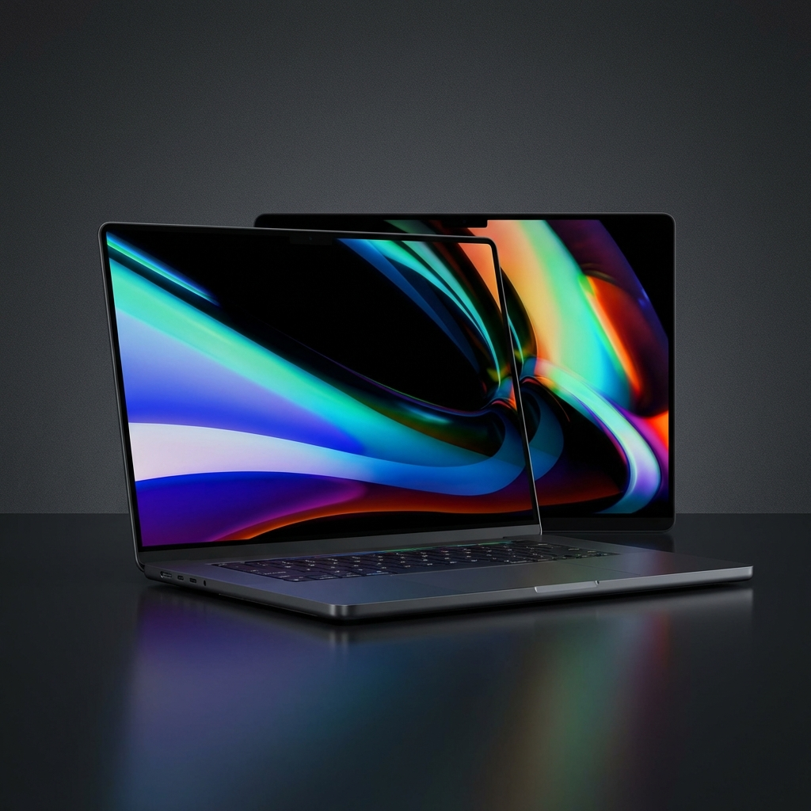
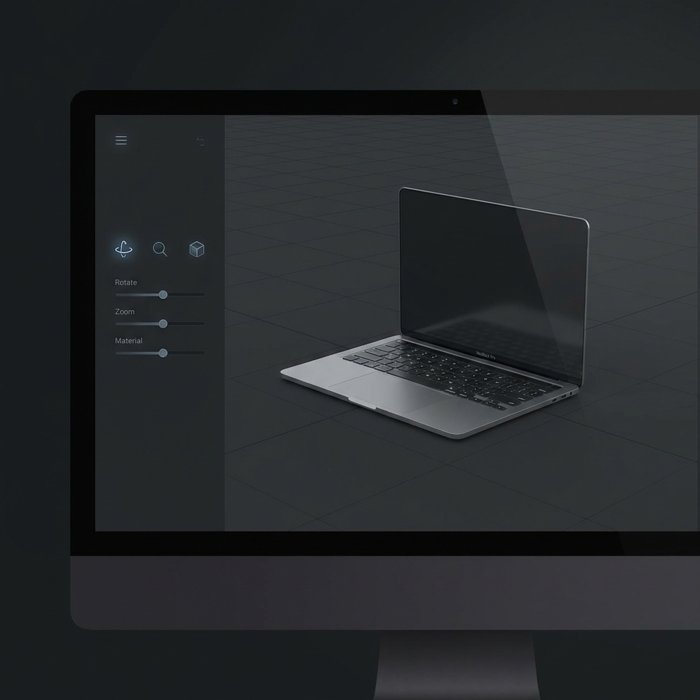

# Apple MacBook Pro Landing Page 💻✨

<div align="center">
  
  <p align="center">
    <strong>A high-performance, visually stunning landing page built with React, GSAP, and Three.js.</strong>
  </p>

[](https://reactjs.org/)
[](https://vitejs.dev/)
[](https://greensock.com/gsap/)
[](https://threejs.org/)
[](https://tailwindcss.com/)

</div>

---

## 🚀 Overview

This project was created as a hands-on learning journey to master **Three.js** and **GSAP**. It is a premium landing page clone for the Apple MacBook Pro, designed to showcase advanced web animation techniques and interactive 3D product visualization.

Using this project, I explored:

- Buttery-smooth scroll interactions with **GSAP**.
- Immersive 3D rendering and model manipulation with **React Three Fiber (Three.js)**.
- Modern frontend architecture with React 19 and Vite.

## ✨ Key Features

- 📱 **Responsive Design**: Fully optimized for all device sizes.
- 🎭 **Smooth Animations**: Powered by GSAP (GreenSock) for high-performance scroll triggers and staggered reveals.
- 🧊 **3D Product Viewer**: Interactive 3D MacBook model using Three.js and React Three Fiber.
- ⚡ **Cutting-edge Tech**: Built with React 19 and Vite for lightning-fast environment and optimized builds.
- 🎨 **Premium UI**: Modern dark-mode aesthetic with sleek typography and high-quality assets.

---

## 📸 Demo Highlights

<div align="center">
  <table>
    <tr>
      <td width="50%">
        
        <p align="center">🚀 <strong>Extreme Performance</strong><br>Visualizing the power of the M-series chips.</p>
      </td>
      <td width="50%">
        
        <p align="center">🧊 <strong>3D Interactivity</strong><br>Explore the MacBook from every angle.</p>
      </td>
    </tr>
  </table>
</div>

---

## 🛠️ Tech Stack

- **Framework**: [React 19](https://react.dev/)
- **Build Tool**: [Vite](https://vitejs.dev/)
- **Animations**: [GSAP](https://greensock.com/gsap/) & [ScrollTrigger](https://greensock.com/scrolltrigger/)
- **3D Rendering**: [Three.js](https://threejs.org/), [React Three Fiber](https://github.com/pmndrs/react-three-fiber), [Drei](https://github.com/pmndrs/drei)
- **Styling**: [Tailwind CSS 4](https://tailwindcss.com/)
- **State Management**: [Zustand](https://github.com/pmndrs/zustand) (or React State)

---

## ⚙️ Installation & Usage

Follow these steps to get the project running locally:

### 1. Clone the repository

```bash
git clone https://github.com/your-username/apple-macbook-landing-page.git
cd apple-macbook-landing-page
```

### 2. Install dependencies

```bash
npm install
# or
yarn install
```

### 3. Run the development server

```bash
npm run dev
```

Open [http://localhost:5173](http://localhost:5173) in your browser to see the result.

### 4. Build for production

```bash
npm run build
```

---

<div align="center">
  <a href="#top">Back to top</a>
</div>
